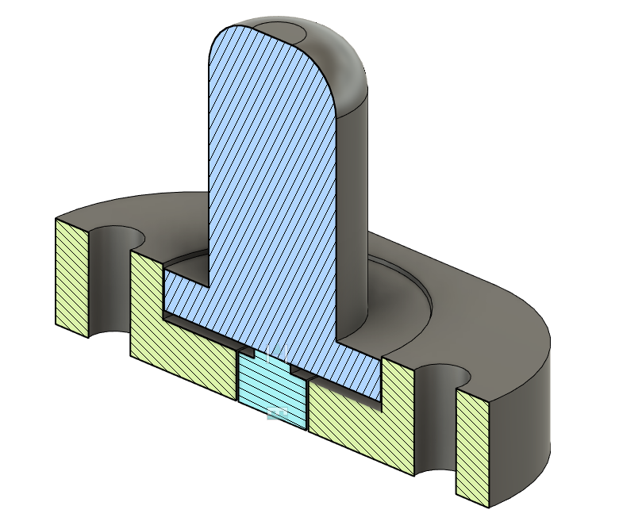
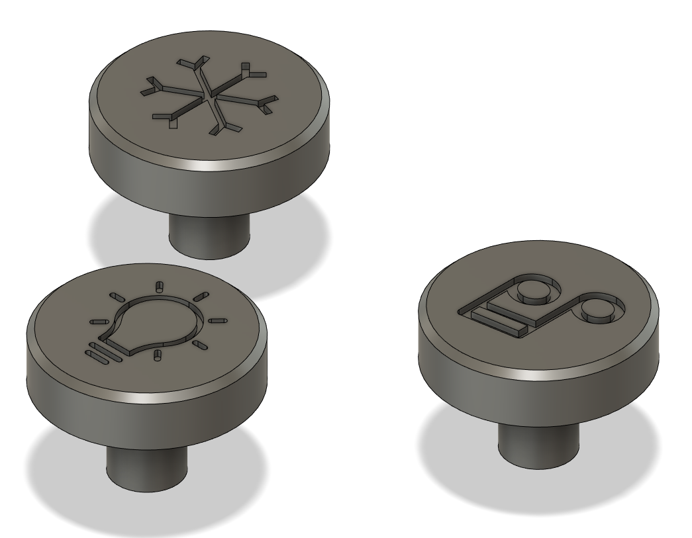

# Printed Parts

## Mounting Hardware

For the mounting, a bunch of things were printed to hold everything in place.
Chances are you'll want to redo a lot of these for your own uses but they're included for reference.

## Push Buttons

A simple housing was done for the micro switches to make them mount into the front face of the table.

||
|:--:|
| <b>Mounting hardware for the push buttons</b> |

The idea was vuguely to make the push buttons look like studs on the table.

## Rotary Encoders

Knobs were designed with an embossed icon indicating the purpose of each knob.

||
|:--:|
| <b>Custom encoder knobs</b> |